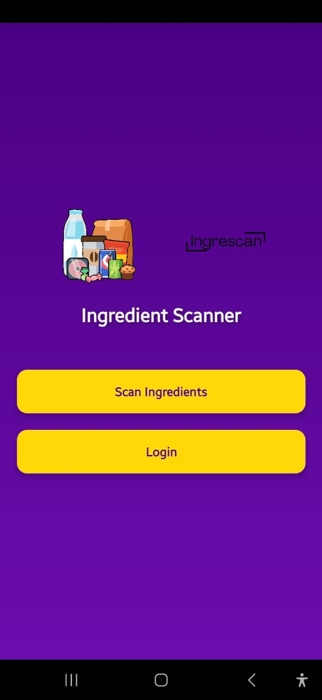
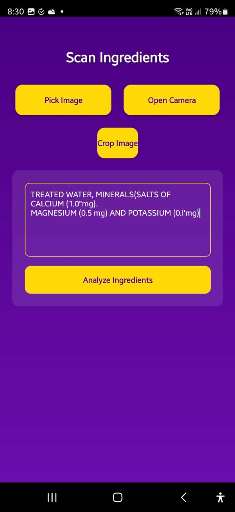
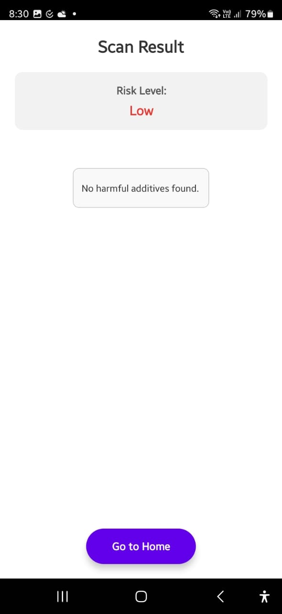

# 🥫 IngreScan – Food Ingredient Scanner & Risk Analyzer

IngreScan is a mobile-based application that uses OCR and Machine Learning to analyze Indian packaged food labels, detect harmful ingredients, and classify food risk levels based on user health profiles.

---

## 📌 Table of Contents

- [🎯 Objective](#-objective)
- [📁 Folder Structure](#-folder-structure)
- [🚀 How It Works](#-how-it-works)
- [📊 Dataset & Preprocessing](#-dataset--preprocessing)
- [📈 Machine Learning Model](#-machine-learning-model)
- [🛠️ Tech Stack](#️-tech-stack)
- [🔧 Installation & Usage](#-installation--usage)
- [📱 Screenshots](#-screenshots)
- [✅ Results](#-results)

---

## 🎯 Objective

- Extract ingredients from Indian packaged food labels using mobile-based OCR.
- Analyze extracted ingredients for harmful substances.
- Use a machine learning model to predict food risk levels.
- Provide explanations based on additives and user health data (e.g., allergies, diabetes).

---

## 📁 Folder Structure

```bash
IngreScan/
│
├── IngreScan Modeling/
│   ├── backend/
│   │   ├── app.py                # Main Flask API server
│   │   ├── auth.py               # Token/authentication handling
│   │   └── predict.py            # Risk prediction logic
│   │
│   ├── IngreScan.ipynb                         # ML training & EDA notebook
│   ├── api integration for testing.ipynb       # API interaction testing
│   ├── additive_expl_dict.pkl                  # Dictionary of additive explanations
│   ├── cleaned_products.csv                    # Cleaned product data
│   ├── packaged_food.csv                       # Raw food data
│   ├── risk_predictor_model.pkl                # Trained XGBoost model
│   ├── scaler.pkl                              # Scaler used during preprocessing
│   └── scap.py                                 # Script to scrape OpenFoodFacts data
│
└── src/                                        # React Native mobile app
    ├── components/
    ├── navigation/
    ├── screens/
    └── assets/

## 🚀 How It Works

1. User scans the product label via the mobile app (OCR).
2. Text is extracted using **ML Kit**.
3. Extracted text is sent to the **Flask backend** via API.
4. Preprocessing and analysis are performed using the trained **XGBoost model**.
5. The API returns a **risk level** with **additive explanations**.

---

## 📊 Dataset & Preprocessing

- **Source**: [Open Food Facts](https://world.openfoodfacts.org/)

### 🔄 Cleaning Steps

- Converted text to lowercase
- Removed stopwords
- Standardized ingredient format
- Generated additional features:

  - `Ingredient_Complexity`
  - `Harmful_Additive_Count`
  - `High_Sugar`, `High_Salt`, `High_Fat` flags

### 📌 Feature Descriptions

| Feature Name               | Description                                 |
|---------------------------|---------------------------------------------|
| Ingredient_Complexity     | Count of ingredients in a product           |
| Harmful_Additive_Count    | Number of known harmful additives           |
| High_Sugar/High_Salt/Fat  | Flags indicating presence of excess nutrients |

---

## 📈 Machine Learning Model

- **Model**: XGBoost Classifier
- **Accuracy**: ~89%
- **Target Classes**: `Low`, `Medium`, `High` Risk

---

## 🛠️ Tech Stack

| Layer         | Tools & Libraries                          |
|---------------|---------------------------------------------|
| Mobile App    | React Native, ML Kit (OCR), Axios           |
| Backend       | Python, Flask, Pickle, Pandas               |
| ML Modeling   | XGBoost, Scikit-learn, Matplotlib, Seaborn  |
| Data Source   | Web Scraping with BeautifulSoup (`scap.py`) |

---

## 🔧 Installation & Usage

### 🖥️ Backend

```bash
# Navigate to backend folder
cd "IngreScan Modeling/backend"

# Install dependencies
pip install -r requirements.txt

# Start the Flask server
python app.py

### 📱 Mobile App
```bash
# Navigate to React Native project
cd src

# Install dependencies
npm install

# Run on physical device or emulator
npx react-native run-android   # or run-ios

📌 Ensure both mobile and backend are connected to the same Wi-Fi network for API requests.

---

## 📱 Screenshots

| Home Screen                  | Scanning                    | Result                     |
|-----------------------------|-----------------------------|----------------------------|
|    |    |  |

---

## ✅ Results

- **Model Accuracy**: `89%`
- **Prediction Speed**: ~`1 second` per request
- **Dynamic Additive Dictionary**: Easily updated using `.pkl` file
- **OCR Integration**: Real-time scanning with React Native **ML Kit**

